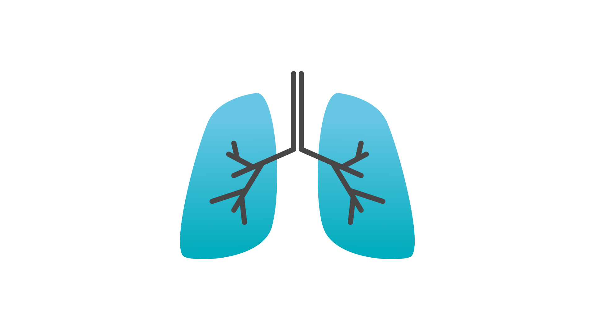

# Anasa

Project Anasa is a model for predicting a person's respiratory type with wave data using the RNN (Recurrent Neural Network) and LSTM (Long Short-Term Memory) deep learning methods.

## Authors

- [Ariana Tulus Purnomo](https://github.com/)
- [Erwin Yonata](https://github.com/yokahealthcare)

## Dataset

The dataset used in this project comes from figshare and is clean data https://figshare.com/articles/dataset/BWF_Breathing_Waveform_Dataset/20001326

## Requirements

- 
- 
- 

## Installation
There are several files that you can operate on
### [Augmented]
the data used is the result of augmentation or is made to add data intentionally
### [Hold-Out] [StratifiedKFold] [GridSearchCV]
the model in using this type of cross-validation method.
### [TestingArea]
This is a testing area for you to customize yourself.
### [CPU] [GPU]
Using what processor is the model compiled. (NB. If there is no sign of anything, then it is run by the CPU.)

#### if you want to do the training yourself, you can be advised to use the command prompt, don't use a python notebook, because if it takes too long the training notebook process can stop for some reason. You can copy the code from the python notebook to a regular python file, then run it in the command prompt.

## Models
In the "Models" menu, there are several types of models that you can use directly to make predictions.

## Usage
This program is used to classify the types of people in breathing, which include,
- normal
- quick
- hold
- deep
- deep_quick

## More Information

You can check more details on this website

http://erwinyonata.com/Anasa/
